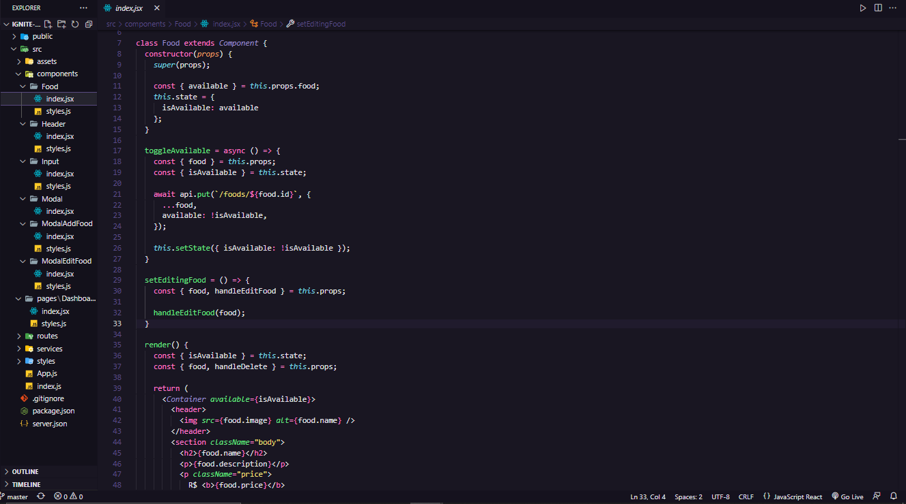
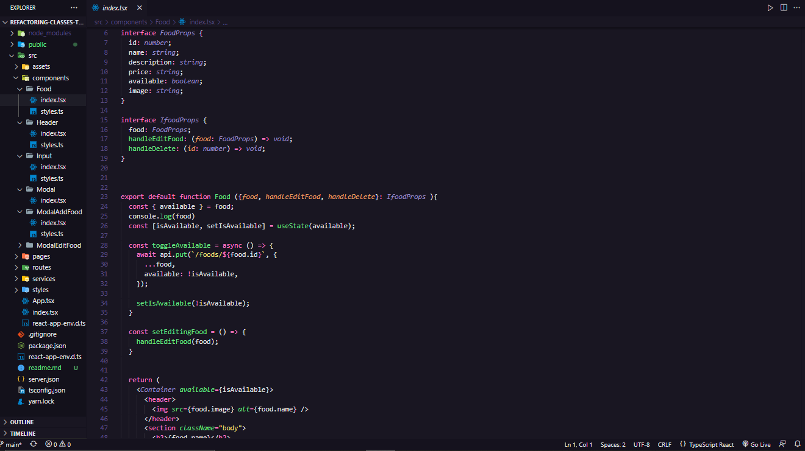

# 💻 Refactoring de classes e typescript

Nesse projeto, recebi uma aplicação que já estava funcional, e o meu objetivo foi converter essa aplicação de Javascript para Typescript.

Além disso, fazer a migração de Class Components para Function Components.

 **Antes:** Abaixo temos um pequeno exemplo de como estava o código antes da refatoração.

* Todo o código escrito em Javacript
* Todo o código em formato de Class Components

 **Depois:** Abaixo temos um exemplo de como ficou o código após a refatoração

* Todo código escrito usando Typescript, inclusive arquivos de estilização.
* Todas as classes foram convertidas em Function Components

## A aplicação continua funcional. Nela é possível fazer algumas operações como :

    
* Adicionar um prato ao cardápio (Inserir imagem, preço, descrição e nome do prato)
* Remover um prato do cardápio    
* Editar um prato no cardápio
* Tornar o prato indisponível ou disponível

# Resultado final:

[Video demostrativo](https://m.youtube.com/watch?v=GidRDzAw3lw&feature=youtu.be)

