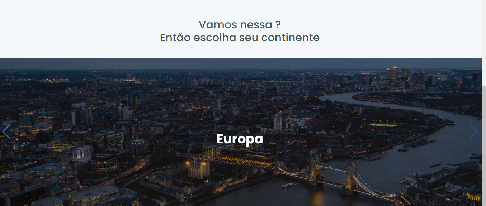
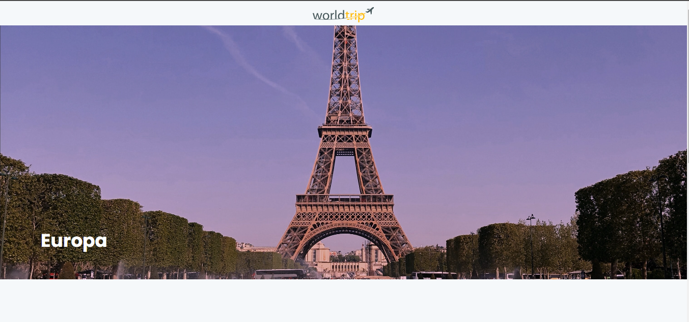

# Interface com ChakraUI  e Next

Este projeto tinha como objetivo implementar a interface de um site de viagens usando ChakraUI e Next.

## 👩‍💻 Tecnologias
- Typescript/Javascript
- Next
- ChakraUI
- Swipper

## Como executar               
    1 - clone o projeto
    2 - yarn
    3 - yarn dev

# Resultado

## Home

## Path /europe

